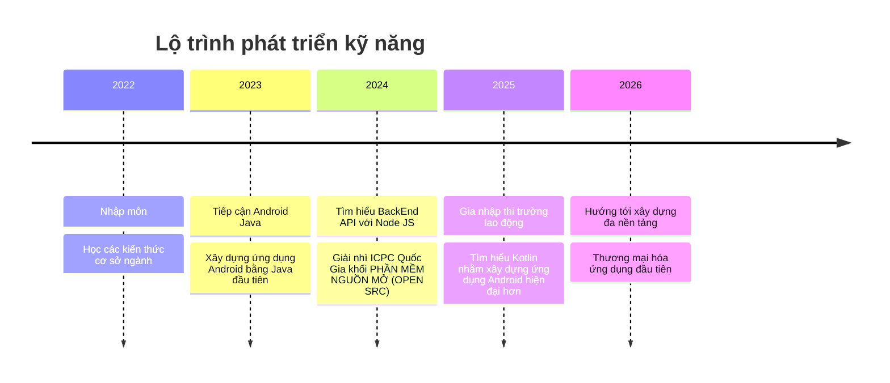

<h1 align="center">Hi 👋, I'm kedokato-dev</h1>

  

  

---

## 🚀 About Me
- 🔭 Sinh viên năm cuối chuyên ngành CNPM tại Đại Học Mở Hà Nội,
- 🌱 Là một lập trình viên Mobile Android, hướng tới fullstack dev,  
- 🎯 Mục tiêu xây dựng một ứng dụng hướng tới cộng đồng,
- 💡 Đang tìm hiểu thêm về AI để ứng dụng nó vào công việc cũng như học tập,
- 📫 Liên hệ: **thocodeanhquan@gmail.com**  

## 🛠️ Tech Stack

  <!-- OS -->
  
  

  <!-- Tools -->
  
  
  
  
  

  <!-- Languages -->
  
  
  
  
  

  <!-- Frameworks & Runtime -->
  
  
  
  
  
  
  

  <!-- Build & Database -->
  
  
  

## 📊 GitHub Stats

  
   
  

 

  
  

## 🎯 Learning Roadmap

## 🌐 Liên hệ & Mạng xã hội  

