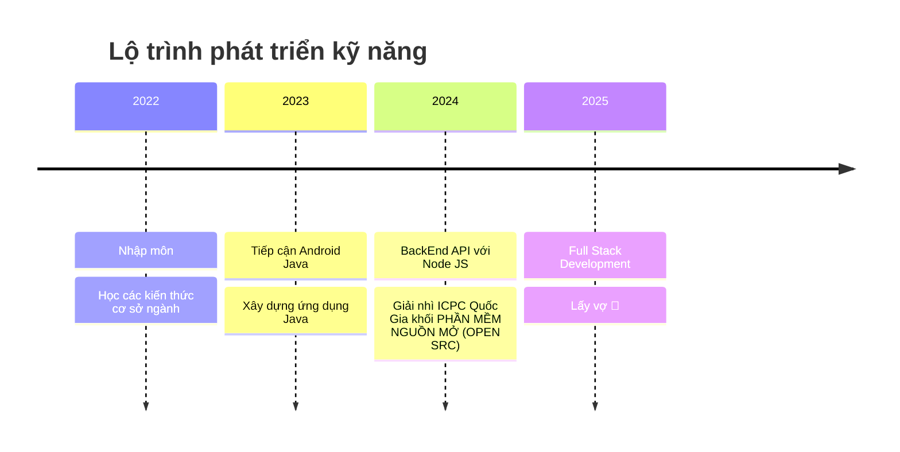

<h1 align="center">Hi 👋, I'm kedokato-dev</h1>

  

  
  <!-- Sử dụng visitor badge từ badges.pufler.dev -->
  

  

    
    
  

  

    
    
  

---

## 🏆 Projects Showcase / Dự án nổi bật

  
  
  

## 🚀 About Me / Giới thiệu  
- 👨‍💻 **ASP.NET Core & Android Developer** với kinh nghiệm phát triển ứng dụng đa nền tảng
- 🔭 Hiện tại mình đang làm việc với **ASP.NET Core & Android Development**  
- 🌱 Đang nghiên cứu về **Jetpack Compose & Backend API Architecture**  
- 🎯 Mục tiêu: Trở thành **Full Stack Developer** với kiến thức chuyên sâu về mobile và web
- 💡 Luôn tìm kiếm cơ hội hợp tác trong các dự án mã nguồn mở
- 📫 Liên hệ: **thocodeanhquan@gmail.com**  

## OS

## 🛠️ Tech Stack / Công nghệ sử dụng

<table align="center">
  <tr>
    <td align="center" width="96">
      
       C#
    </td>
    <td align="center" width="96">
      
       JavaScript
    </td>
<td align="center" width="96">
  
   Kotlin
</td>
    <td align="center" width="96">
      
       Java
    </td>
  </tr>
  <tr>
    <td align="center" width="96"> 
       
       ASP.NET
    </td>
    <td align="center" width="96">
      
       Android
    </td>
    <td align="center" width="96">
      
       Firebase
    </td>
    <td align="center"  width="96">
      
       Bootstrap
    </td>
  </tr>
</table>

## 📊 GitHub Stats / Chỉ số sức mạnh

  
   
  

 

  
  

---

## 🎯 Learning Roadmap / Lộ trình học tập

## 🌐 Liên hệ & Mạng xã hội  

<!-- 
 -->
